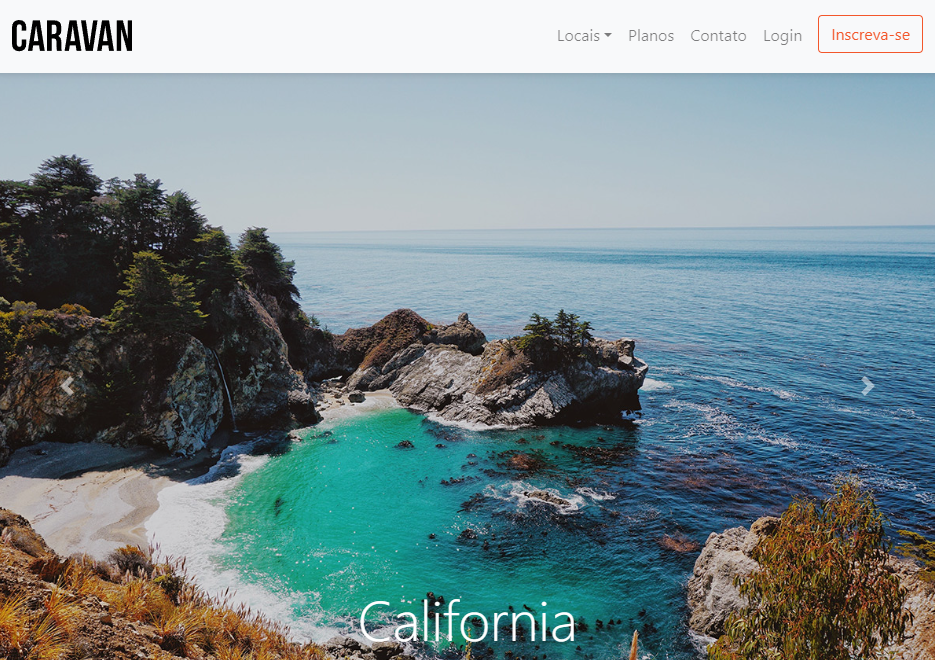

# Caravan - Agência de Turismo

Uma aplicação web para a agência de turismo Caravan, oferecendo informações sobre diversos destinos, planos de viagem e contato.

  

## Interface

  

  

## Sumário

- [Tecnologias Utilizadas](#tecnologias-utilizadas)
- [Status](#status)
- [Descrição](#descrição)
- [Funcionalidades](#funcionalidades)
- [Explicação](#explicação)
- [Como Usar](#como-usar)
- [Autor](#autor)

  

## Tecnologias Utilizadas

  

    
  

  

    
  

  

    
  

  

## Status

  

## Descrição

Caravan é uma aplicação web que promove destinos turísticos, oferece planos de viagem e facilita o contato entre a agência e os clientes. A plataforma utiliza Bootstrap para criar uma interface moderna e responsiva.

  

## Funcionalidades

- Modal de login para usuários.
- Navegação entre páginas de locais, planos e contato.
- Carrossel de imagens destacando destinos turísticos.
- Formulário de inscrição para receber novidades.
- Seção de vantagens com ícones ilustrativos.
- Perguntas frequentes com seções colapsáveis.
- Rodapé com links para redes sociais e informações de contato.# Caravan - Agência de Turismo

Uma aplicação web para a agência de turismo Caravan, oferecendo informações sobre diversos destinos, planos de viagem e contato.

  

## Como Usar

1. Clone o repositório para o seu ambiente local.

2. Abra o arquivo `index.html` no seu navegador preferido.

3. Navegue pelas diferentes seções do site.

  

## Autor

Desenvolvido no curso de Bootstrap da Origamid.
